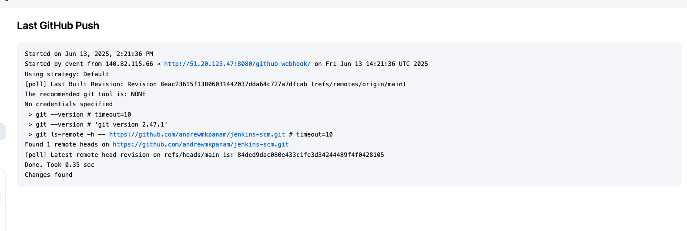

# jenkins-scm

## Github SCM project for Polling:

1. Created a new project names my-first-job
2. Connected Jenkins to the sourcecode management by adding the github url. Repository is public hence credentials are not needed

3. Completed first build
see log below:
Started by user Andrew Mkpanam
Running as SYSTEM
Building in workspace /var/lib/jenkins/workspace/my-first-job
The recommended git tool is: NONE
No credentials specified
Cloning the remote Git repository
Cloning repository https://github.com/andrewmkpanam/jenkins-scm.git
 > git init /var/lib/jenkins/workspace/my-first-job # timeout=10
Fetching upstream changes from https://github.com/andrewmkpanam/jenkins-scm.git
 > git --version # timeout=10
 > git --version # 'git version 2.47.1'
 > git fetch --tags --force --progress -- https://github.com/andrewmkpanam/jenkins-scm.git +refs/heads/*:refs/remotes/origin/* # timeout=10
 > git config remote.origin.url https://github.com/andrewmkpanam/jenkins-scm.git # timeout=10
 > git config --add remote.origin.fetch +refs/heads/*:refs/remotes/origin/* # timeout=10
Avoid second fetch
 > git rev-parse refs/remotes/origin/main^{commit} # timeout=10
Checking out Revision 829b9e7a1d99d7df00c149d5e9ef50f42fb8f6ec (refs/remotes/origin/main)
 > git config core.sparsecheckout # timeout=10
 > git checkout -f 829b9e7a1d99d7df00c149d5e9ef50f42fb8f6ec # timeout=10
Commit message: "Update index.html"
First time build. Skipping changelog.
Finished: SUCCESS

4. Configured webhook triggering on jenkins console by checking the git SCM polling
5. Pushed changes to origin and jenkins picked up and built again: see log below:

Started on Jun 13, 2025, 2:21:36 PM
Started by event from 140.82.115.66 ⇒ http://51.20.125.47:8080/github-webhook/ on Fri Jun 13 14:21:36 UTC 2025
Using strategy: Default
[poll] Last Built Revision: Revision 8eac23615f13806031442037dda64c727a7dfcab (refs/remotes/origin/main)
The recommended git tool is: NONE
No credentials specified
 > git --version # timeout=10
 > git --version # 'git version 2.47.1'
 > git ls-remote -h -- https://github.com/andrewmkpanam/jenkins-scm.git # timeout=10
Found 1 remote heads on https://github.com/andrewmkpanam/jenkins-scm.git
[poll] Latest remote head revision on refs/heads/main is: 84ded9dac080e433c1fe3d34244489f4f0428105
Done. Took 0.35 sec
Changes found
See screenshot below:

5. complete
