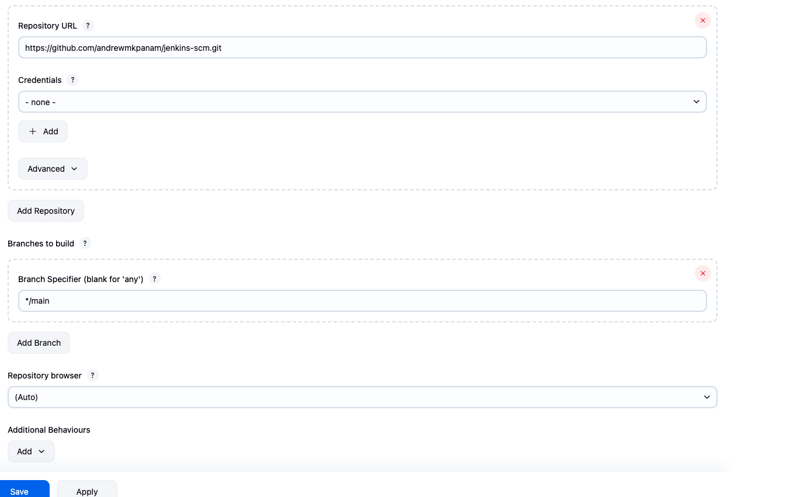
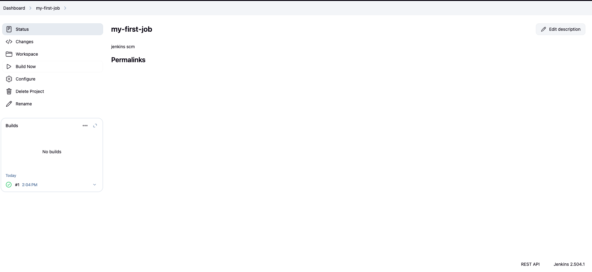

# jenkins-scm

## Github SCM project for Polling:

1. Created a new project names my-first-job
2. Connected Jenkins to the sourcevode management by adding the github url

3. Completed first build

4. Configured webhook triggering on jenkins console by checking the git SCM polling
5. complete
